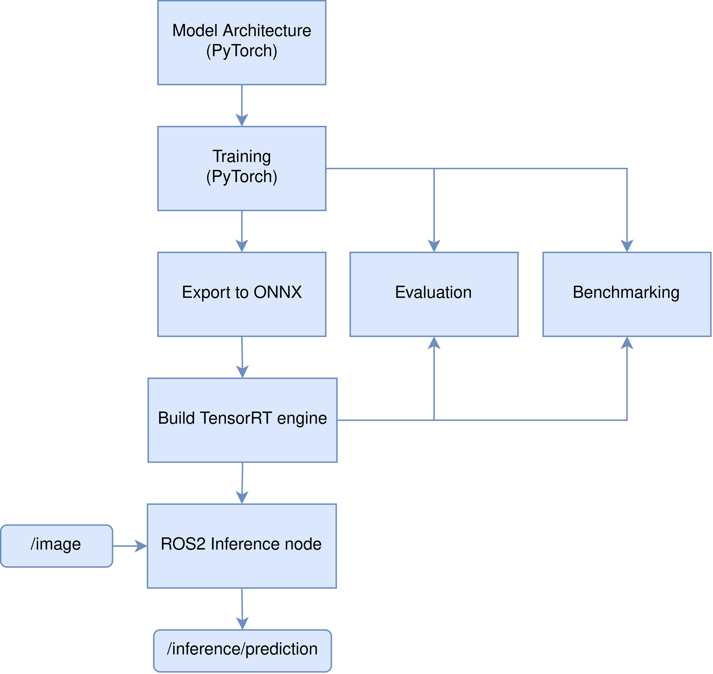
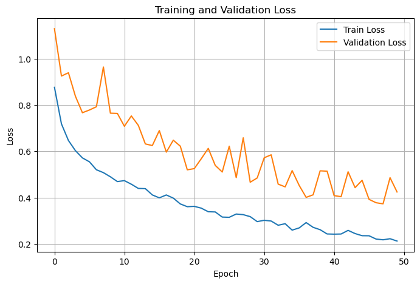
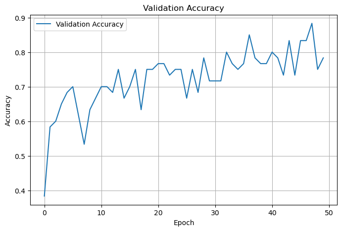
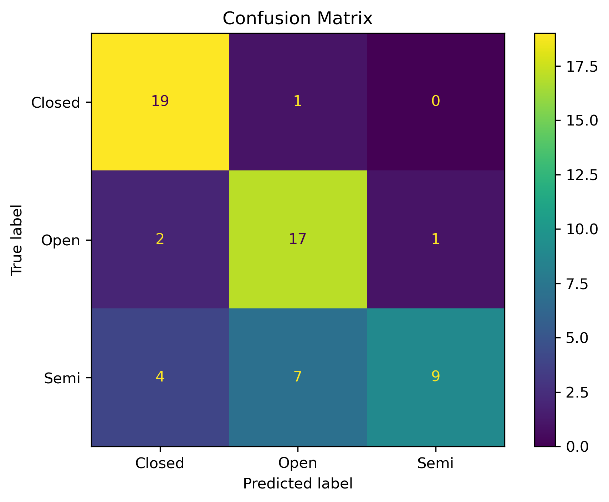
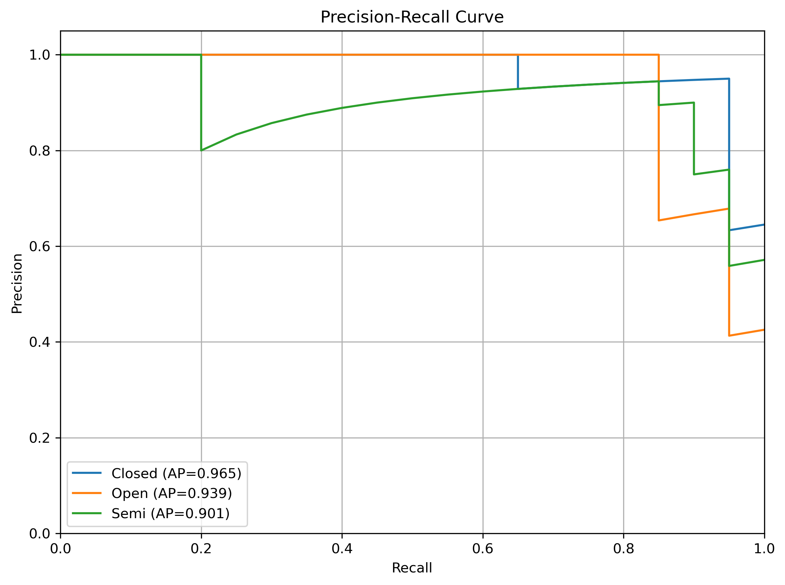
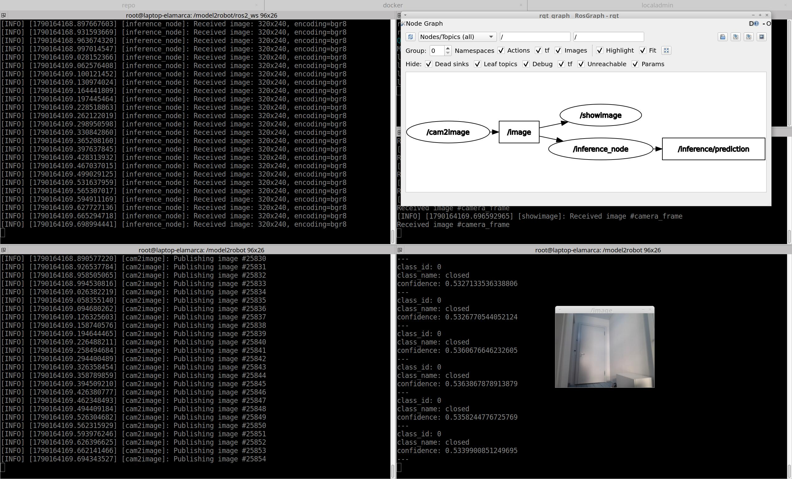

# model2robot: End-to-end machine learning deployment pipeline for ROS2 robots

`model2robot` demonstrates how a computer vision model can be developed, evaluated, optimized, and deployed on a robot using **PyTorch**, **ONNX**, **TensorRT**, and **ROS2**.

The project focuses on the engineering workflow required to move a model from training to real-time robotic inference rather than on achieving state-of-the-art classification performance.

## Use case: Door State Classification

The project uses a **door state classification** task as a simple, representative computer vision problem to demonstrate the complete model-to-robot pipeline. Given an image of a door, the model classifies its state as **open, closed, or semi-open**. The classification task itself is intentionally kept simple so that the focus remains on taking a trained model from development to an optimized, reproducible deployment running within a ROS2 robotic system.

However, it is a use case pretty common in the mobile robotics world, where robots may need to understand the state of doors to navigate through indoor environments, plan their movements, or interact with their surroundings.

### Dataset

The classification model is trained using the [Door Classification Dataset](https://github.com/gasparramoa/DoorDetect-Class-Dataset), which contains images of doors labeled according to their state: **open, closed, or semi-open**.

The dataset is used as the starting point for training and evaluating the model before exporting it for deployment in the model-to-robot pipeline.

For this use case, only the original-sized RGB images were used, rather than the cropped versions. The depth channel was excluded, as I currently do not have an RGB-D camera available and wanted to test the model in real time using a standard RGB camera.

## Environment

The project is developed and tested inside a **Docker container** to keep the software environment reproducible across machines. The container provides the required Python, PyTorch, CUDA, TensorRT, and ROS2 dependencies used throughout the pipeline.

The experiments described in this README were run on the following hardware:

* **GPU:** NVIDIA GeForce RTX 4060 (8GB VRAM)
* **NVIDIA Driver:** 535.309.01
* **CUDA:** 12.2

> **Note:** The Docker configuration may need to be adjusted depending on the host machine, NVIDIA driver, available GPU, and CUDA/TensorRT compatibility. The provided configuration reflects the environment used for this project and is intended as a reproducible starting point rather than a one-size-fits-all setup.

The corresponding `Dockerfile` and `compose.yaml` files are located at the root of the repository and can be used to build and run the project environment.

## Overview



The ROS2 inference node is independent of the underlying inference engine (PyTorch or TensorRT). Additional inference engines can be supported by implementing the `Inference` abstract base class defined in `src/model2robot/inference/inference.py`.

## Features

- PyTorch model training
- Reproducible training experiments
- ONNX model export
- TensorRT engine generation 
- PyTorch and TensorRT inference backends
- PyTorch and TensorRT evaluation and benchmarking
- Experiment provenance and configuration tracking
- ROS2 inference node with custom prediction message
- Dockerized development environment

## Project Structure

The project is separated into two main layers:

- `src/model2robot/` contains the reusable machine learning and inference components.

  - It is installed as a Python package in editable mode inside the Docker environment (see `pyproject.toml` and `compose.yaml`).
  - This makes the package available within the ROS2 workspace while allowing the code to be modified and developed without rebuilding the Python package after every change.
- `ros2_ws/` contains the ROS2 workspace, including the packages, nodes, and custom messages created for the project.

This separation keeps the ML implementation independent of ROS2 while allowing trained models to be integrated into a robotic system.

The `scripts/` folder contains the scripts required to execute each step of the pipeline, along with their corresponding configuration files. Configuration templates can be found in `configs/`.

The `models/` and `datasets/` folders contain the PyTorch model and dataset implementations specific to this use case. I called the model **Classificadoor** (I know, it's cool). These components are kept outside the reusable Python package because they are use-case dependent, similarly to the scripts in `scripts/`.

> **Note:** The current training, evaluation, and report generation components are designed specifically for **classification tasks**. They are included in the reusable Python package (`src/model2robot/training` and `src/model2robot/evaluation`) so they can be reused across different classification use cases. For other types of tasks, such as object detection or segmentation, new task-specific classes or functions may need to be implemented as required.

Finally, the `experiments/` folder contains the results of an example experiment used to validate the pipeline and provide the results shown in this README. The `docs/` folder contains diagrams, images, and other documentation assets used throughout the README.

## Running the Pipeline

This section explains how to run each step of the pipeline while providing examples from the experiments I ran for this use case.

### 1. Docker Setup

Before starting, make sure the dependencies in the `Dockerfile` match your hardware, NVIDIA drivers, and available GPU.

From the root of the repository, build and start the Docker container:

```bash
# Build the Docker image
docker compose build

# Start the container in detached mode
docker compose up -d

# Attach to the running container
docker compose attach model2robot
```

To open a new terminal inside the same running container, use:

```bash
docker compose exec model2robot bash
```

If you need to run GUI applications from inside the container (e.g., `rqt_graph`), you may need to allow the Docker container to access the host display:

```bash
xhost +local:docker
```

The required setup may vary depending on your host system and graphical environment.

### 2. Training

The next step is to train the **Classificadoor** model using the door-state dataset described above.

The training script initializes the model, loads the training and validation datasets, creates the corresponding dataloaders, and starts the training process. Once training is complete, it generates a report containing the training metrics and learning curves. Only the best-performing model checkpoint is saved.

In order to run the script:

```bash
python3 scripts/train.py /path/to/config
```

See `configs/train_config.yaml` for a configuration template.

See `experiments/train/pytorch/experiment02/` for an example of the artifacts generated by the training process.

The following are the learning curves from the example experiment used throughout this README.

<p align="center">
  
  
</p>

There are certainly several ways to improve the model, such as applying data augmentation, incorporating the depth channel, or using deeper architectures. However, as mentioned previously, achieving the best possible classification performance is not the main objective of this project. The goal is to demonstrate the complete model-to-robot pipeline.

That said, the results are not too bad either.

### 3. Exporting to ONNX

Now that we have the trained PyTorch model saved as `best_model.pth` in the output folder of the training phase, the next step is to export it to ONNX. TensorRT can use ONNX as an intermediate representation to build the optimized TensorRT engine.

PyTorch provides built-in functionality for exporting models to ONNX. The export script creates a dummy input batch, which is used by the ONNX exporter to trace the model's computation graph, loads the trained PyTorch model, exports it to ONNX, and finally validates the generated ONNX file.

In order to run the script:

```bash
python3 scripts/export_to_onnx.py /path/to/config
```

See `configs/export_to_onnx_config.yaml` for a configuration template.

See `experiments/onnx/experiment02_bs32/` for an example of the artifacts generated during the PyTorch-to-ONNX export step.

> **Important:** The batch size used during ONNX export is important because the exported model defines the input shape expected by the TensorRT engine. When using a fixed input shape, the TensorRT engine will only accept inference inputs with the same batch size used when building the engine. Therefore, make sure to use the intended batch size when exporting the model. For example, if the ONNX model is exported with a batch size of 32, the resulting TensorRT engine will expect inputs with a batch size of 32.

### 4. Building TensorRT engine

This step takes the generated ONNX model, `best_model.onnx`, and builds a TensorRT engine from it using the TensorRT builder and ONNX parser.

In order to run the script:

```bash
python3 scripts/build_tensorrt.py /path/to/config
```

See `configs/build_tensorrt_config.yaml` for a configuration template.

See `experiments/tensorrt/experiment02_bs32/` for an example of the artifacts generated during the ONNX-to-TensorRT conversion step.

See the [NVIDIA TensorRT Quick Start Guide](https://docs.nvidia.com/deeplearning/tensorrt/latest/getting-started/quick-start-guide.html) for more information.

### 5. Evaluation

Now, we have everything we need to evaluate and benchmark the models. Both processes are independent of the underlying inference engine, whether it is PyTorch or TensorRT. Additional inference engines can be supported by implementing the `Inference` abstract base class defined in `src/model2robot/inference/inference.py`.

Let's start with the evaluation.

The evaluation script loads the specified model, either PyTorch or TensorRT, creates the corresponding inference instance, loads the test dataset, creates the test dataloader, and runs inference on the test set.

Once the predictions and their probabilities are available, the script generates a report containing the test metrics, confusion matrix, precision-recall curves, and a `predictions.csv` file. The CSV contains information for every prediction made on each test image, allowing us to analyze which types of images are causing errors and identify potential improvements to the dataset and training process.

In order to run the script:

```bash
python3 scripts/evaluate.py /path/to/config
```

See `configs/evaluate_config.yaml` for a configuration template.

See `experiments/evaluate/tensorrt/experiment02_bs32/` for an example of the artifacts generated during the evaluation step.

I ran the evaluation in both PyTorch and TensorRT modes to verify that they produce similar results, and they do.

Below are the confusion matrix and precision-recall curves for the trained model.

<p align="center">
  
  
</p>

It can be seen that the class with the most confusion is **semi-open**, which makes sense since it represents an intermediate state between open and closed.

### 6. Benchmarking

The benchmarking step is particularly interesting because one of the main motivations for building a TensorRT engine is to optimize the model for **low-latency and high-throughput inference**, which is especially important for real-time applications and deployment on edge devices.

Therefore, benchmarking allows us to quantify the performance differences between the original PyTorch model and the optimized TensorRT engine and verify whether the optimization provides a meaningful inference speedup.

The benchmarking script follows a similar process to the evaluation script. However, instead of evaluating the predictions, it measures inference latency, throughput, and memory usage.

Some considerations:

- The dataloader discards the last batch, since it may be incomplete and could affect the metrics with unrepresentative values.
- Both benchmarks were run on the same computer using a batch size of `32`.
- The benchmarking process discards the first iterations from the metric calculations, as they may be affected by initialization and other startup overhead. However, their latency is still recorded for comparison with subsequent iterations.
- You can specify any number of warm-up and benchmarking iterations in the configuration file. The `Benchmarker` automatically cycles through the dataloader as many times as necessary to reach the requested number of iterations.

In order to run the script:

```bash
python3 scripts/benchmark.py /path/to/config
```

See `configs/benchmark_config.yaml` for a configuration template.

See `experiments/benchmark/tensorrt/experiment02_bs32/` for an example of the artifacts generated during the benchmarking step.

Below there is a comparative table of PyTorch and TensorRT inference.

| Metric                       | PyTorch   | TensorRT   |
| ---------------------------- | ------:   | -------:   |
| First inference latency (ms) | `352.80`  |  `55.72`   |
| Mean latency (ms)            | `79.00`   |  `36.57`   |
| Median latency (ms)          | `77.60`   |  `36.56`   |
| Latency std. dev. (ms)       | `2.83`    |  `0.05`    |
| Minimum latency (ms)         | `76.43`   |  `36.52`   |
| Maximum latency (ms)         | `84.55`   |  `36.89`   |
| Throughput (samples/s)       | `405.08`  |  `874.92`  |
| GPU memory baseline (MiB)    | `360.94`  |  `1002.94` |
| GPU memory peak (MiB)        | `1290.94` |  `1002.94` |
| Additional GPU memory (MiB)  | `930.00`  |  `0.0`     |

The results show a clear improvement in inference performance when using TensorRT. Mean latency is reduced from **79.00 ms to 36.57 ms**, while throughput increases from **405.08 to 874.92 samples/s**, providing more than a 2× improvement in throughput. TensorRT also shows much more consistent inference times, with a latency standard deviation of only **0.05 ms** compared to **2.83 ms** with PyTorch. The first inference is also significantly faster with TensorRT, decreasing from **352.80 ms to 55.72 ms**. On the other hand, the memory measurements show that PyTorch increases GPU memory usage by approximately **930 MiB** during inference, while TensorRT remains at its baseline of approximately **1003 MiB**. This stable memory usage with TensorRT is achieved by allocating reusable input and output buffers directly on the GPU, which avoids repeated memory allocations during inference. Overall, these results demonstrate the benefits of converting the trained model to a TensorRT engine for low-latency and high-throughput inference.

## ROS2 Deployment

Now that we have the TensorRT engine ready, the next step is to deploy it within a ROS2 system.

For this, I created two ROS2 packages:

* `model2robot_inference`: contains the inference node.
* `model2robot_msgs`: contains the custom prediction message.

This separation allows the inference node and prediction message to be used independently.

### Building the ROS2 packages

From `ros2_ws/`, build the ROS2 workspace with:

```bash
# The --symlink-install option is optional,
# but recommended during development.
# It allows you to modify Python files without
# rebuilding the package after every change.

colcon build --symlink-install

# A custom .bashrc is shared with the Docker image.
# See compose.yaml for the configuration.
source /root/.bashrc
```

### Inference node

The inference node follows a simple pipeline:

1. It reads the configuration file (see `configs/ros2_inference_node_config.yaml`).
2. It initializes the specified inference engine, either PyTorch or TensorRT.
3. It initializes the specified image transformation pipeline. This allows the received images to be preprocessed before inference.
4. It subscribes to the `/image` topic.
5. Whenever an image is received, the image callback preprocesses the image and runs inference.
6. Once the prediction is available, the node publishes it to the configured prediction topic using the custom prediction message described below.

The prediction message is designed for classification tasks. For other types of tasks, such as object detection or segmentation, a different prediction message may be required.

The current message contains the following fields:

```text
int32 class_id
string class_name
float32 confidence
```

> **Important:** Remember to build the TensorRT engine with a batch size of `1` so that it can perform inference on individual images!

### Running the ROS2 experiment

The following image shows the complete ROS2 inference pipeline running with a webcam:

<p align="center">
  
</p>

To reproduce the experiment:

#### 1. Run the inference node

```bash
ros2 run model2robot_inference inference_node --ros-args -p config_path:="/path/to/config"
```

#### 2. Run the camera node

The `cam2image` node from the `image_tools` package can be used to publish images from a connected camera:

```bash
ros2 run image_tools cam2image
```

> **Note:** When running inside Docker, make sure the required devices and volumes are shared with the container so that it can access the camera. For this experiment, I used my computer's webcam.

#### 3. Display the camera images

The `showimage` node subscribes to the `/image` topic and displays the received images in real time:

```bash
ros2 run image_tools showimage
```

> **Note:** Depending on the camera and image encoding, the displayed image may appear with the RGB channels reversed. The important part is to ensure that the channel order used during preprocessing in the inference node matches the channel order used when training the model. The expected channel order can be configured in the inference configuration file.

#### 4. Visualize the ROS2 graph

To visualize the nodes and topics:

```bash
rqt_graph
```

#### 5. Inspect the predictions

You can directly subscribe to the `/inference/prediction` topic using `ros2 topic echo`. This is useful for debugging without having to create an additional ROS2 node.

```bash
ros2 topic echo /inference/prediction
```

The topic name can be configured according to your setup.

The idea is that the prediction message can then be consumed by a control or decision-making node, allowing the robot to use the model's predictions as input for subsequent actions.

## Design Principles

The project is designed around the following principles:

* **Separation of concerns:** Keep the ML components independent from the ROS2 integration and deployment layer.
* **Engine independence:** The ROS2 inference node does not depend on a specific inference engine. PyTorch and TensorRT are supported through a common `Inference` abstract class.
* **Reproducibility:** Use Docker, configuration files, and explicit experiment artifacts to make the development environment reproducible.
* **Experiment provenance:** Keep experiment manifests and generated artifacts together to track the configuration, model, dataset, and results associated with each experiment.
* **Modularity:** Separate reusable components from use-case-specific models, datasets, scripts, and configurations.
* **Hardware-aware deployment:** Consider memory usage, latency, and throughput as part of the deployment pipeline rather than only focusing on model accuracy.
* **Real-world integration:** Validate the complete pipeline with a real camera and ROS2 nodes, rather than evaluating the model only in an offline environment.
* **Extensibility:** Make it straightforward to add new inference engines, preprocessing pipelines, models, and ROS2 components as the project evolves.

## Future Work

Some possible directions for extending the project are:

* **Improve model performance:** Experiment with data augmentation, deeper architectures, and the depth channel to improve classification accuracy.
* **Support additional task types:** Extend the training and evaluation components beyond classification to support tasks such as object detection and segmentation.
* **Add more inference backends:** Implement additional inference backends using the `Inference` abstract class to support other inference engines and deployment frameworks.
* **Dynamic TensorRT shapes:** Support dynamic input shapes and batch sizes instead of building engines for a fixed input shape.
* **Real robotic deployment:** Integrate the pipeline with a physical robot and use the predictions as input to a navigation or decision-making system.
